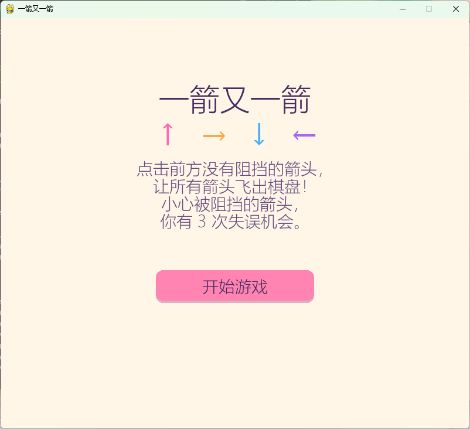
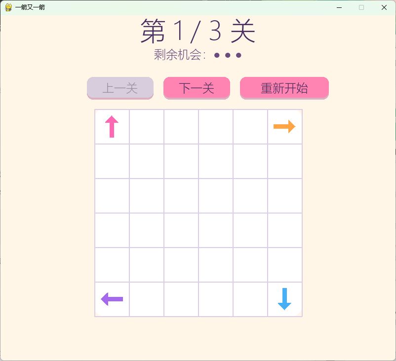
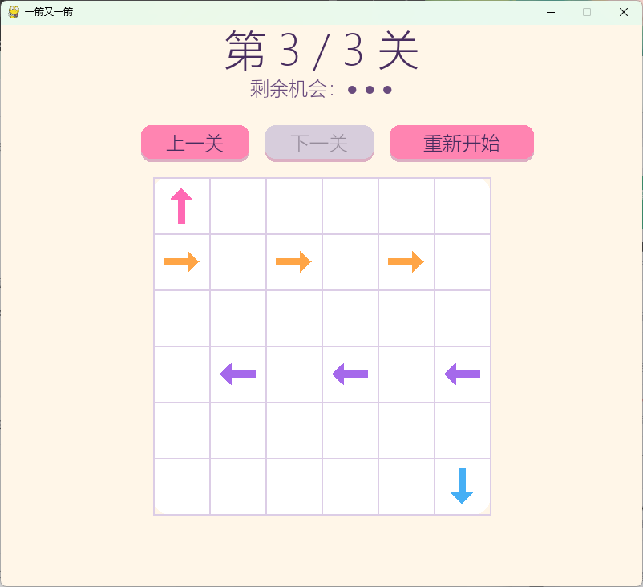
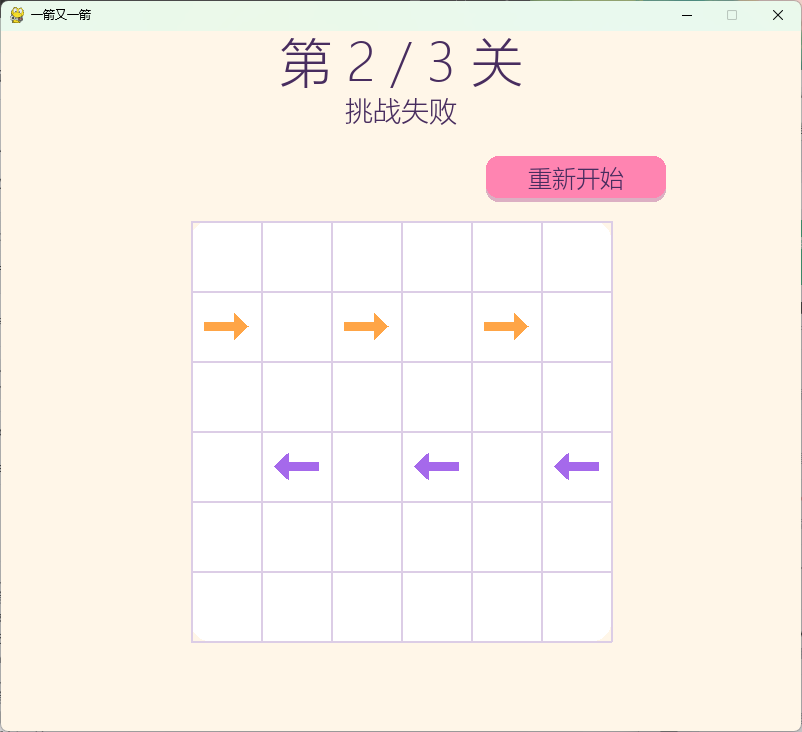
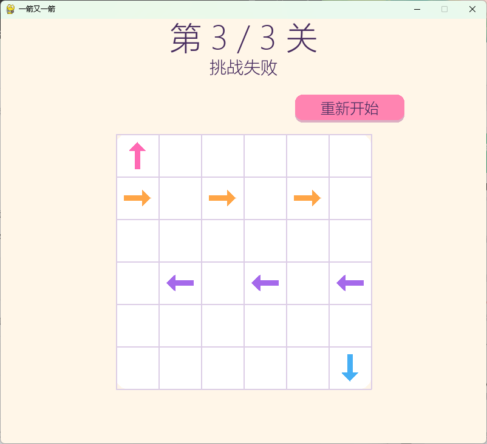

# 一箭又一箭

## 项目介绍

这是一个使用 Python + Pygame 开发的点击式箭头解谜小游戏，也是软件工程课程第二次个人作业。

玩家需要观察箭头方向和阻挡关系。点击箭头后，如果该方向直到棋盘边界没有其他箭头阻挡，箭头会飞出棋盘；如果存在阻挡，箭头不会移除，并消耗一次失误机会。清除所有箭头即可通过当前关卡。目前共有 3 个可通关关卡。

## 游戏截图

### 开始界面



### 游戏界面



### 本关通过



### 挑战失败



### 全部通关



## 主要功能

- 6×6 棋盘
- 上、下、左、右四方向箭头
- 鼠标点击操作
- 四方向路径阻挡检测
- 箭头飞出动画
- 碰撞反馈
- 每关 3 次失误机会
- 3 个可通关关卡
- 本关通过
- 挑战失败
- 全部通关
- 当前关卡重新开始
- 游戏中上一关 / 下一关导航
- 中文游戏界面
- 多巴胺糖果色 UI

## 游戏操作

1. 点击“开始游戏”。
2. 点击棋盘中的箭头。
3. 无阻挡箭头会沿方向飞出。
4. 被阻挡箭头不会移动，并消耗一次机会。
5. 清除全部箭头即可通过当前关卡。
6. 机会耗尽进入“挑战失败”。
7. 游戏中可以使用“上一关”“下一关”浏览三个关卡。
8. “重新开始”恢复当前关卡初始布局和 3 次机会。

## 开发环境

- Python 3.x
- Pygame 2.6.1
- Windows

## 安装与运行

克隆项目：

```powershell
git clone https://github.com/Lrainnn310/ArrowGame.git
```

进入项目目录：

```powershell
cd ArrowGame
```

安装依赖：

```powershell
python -m pip install -r requirements.txt
```

启动游戏：

```powershell
python main.py
```

## 项目结构

```text
ArrowGame/
├── docs/
│   └── images/
├── tests/
├── main.py
├── board.py
├── models.py
├── path_detection.py
├── game_logic.py
├── state_logic.py
├── requirements.txt
├── .gitignore
└── README.md
```

- `main.py`：Pygame 主循环、UI、输入和状态展示
- `board.py`：棋盘和箭头绘制、关卡数据
- `models.py`：箭头、方向、飞行动画和游戏状态数据结构
- `path_detection.py`：四方向路径阻挡检测
- `game_logic.py`：点击箭头后的核心处理
- `state_logic.py`：通关、失败、Restart 和关卡导航
- `tests/`：`unittest` 自动测试

## 核心逻辑

每个方向映射为二维方向向量：

```text
UP    = (-1, 0)
DOWN  = (1, 0)
LEFT  = (0, -1)
RIGHT = (0, 1)
```

从当前箭头的下一格开始，沿箭头方向逐格扫描直到棋盘边界。途中发现箭头，判定为 `blocked`；扫描到边界仍没有箭头，判定为可以飞出。

对于行数为 `R`、列数为 `C` 的棋盘，单次路径检测的时间复杂度为 `O(max(R, C))`。

## 测试

项目使用 Python 标准库 `unittest`。运行测试：

```powershell
python -m unittest discover -s tests -v
```

当前有 **34 个 unittest 全部通过**，测试覆盖：

- 无阻挡箭头移除
- 被阻挡箭头保留并扣除机会
- 边缘箭头
- 空棋盘
- 空白点击
- 通关
- 失败
- Restart
- 三个关卡可解
- 上一关 / 下一关导航
- 原始关卡数据保护

Pygame UI、动画和按钮布局还进行了人工运行验收，未声称所有 UI 都由 `unittest` 自动测试覆盖。

## 项目说明

本项目为软件工程课程个人作业。开发过程中使用 AIGC / Coding Agent 辅助完成需求分析、代码实现、测试设计和 Bug 检查。所有功能均经过人工运行、测试和验收。详细 AIGC 使用过程和 PSP 分析记录在课程博客中。
